# Feasibility Data Model — Revised ERD (Fabric Lakehouse target)

Revision of `feasibility_erd_latest.md`, applying the decisions from the
ingestion grill (`FABRIC_INGESTION_DESIGN.md`). Target = OneLake Lakehouse
Delta tables. Only **deltas** are detailed here; unchanged tables stay as in the
original doc.

---

## 1. Change log vs `feasibility_erd_latest.md`

| Action | Object | Reason |
|---|---|---|
| ❌ DROP | `DIM_CURRENCY` + every `currency_key` on facts | Single-currency (RM). Currency is a `DIM_PROJECT` attribute, not a fact FK. Re-add only if cross-border. |
| ❌ DROP | `DIM_SOURCE` as a joined dimension | Demote to a **degenerate column** `source_code STRING` on `FACT_FEASI_SUMMARY`. No surrogate, no join, out of the grain. |
| ❌ DROP | `BRIDGE_DEVELOPMENT_HIERARCHY` | Hierarchy is fixed ≤5 levels with flattened `level_1..5` columns — roll-up = filter on `level_n_key`. Bridge only earns its keep for ragged/variable-depth trees. |
| ➕ ADD | `FACT_PROJECT_CASHFLOW` | The keystone. Time-phased outflow/inflow → enables IRR/NPV/peak-funding. Was "later" in the original; promoted to core. |
| 🔧 MOD | `DIM_DEVELOPMENT_COMPONENT` + `tenure` | SELL / LEASE / HOLD. Held assets (office/hotel) need it for GRR/investment modelling. |
| 🔧 MOD | `DIM_FEASI_LINE` + `aggregation_rule`; extend `line_type` | Tag ADDITIVE / SEMI_ADDITIVE / NON_ADDITIVE so BI never sums a ratio/IRR line. |
| 🔧 MOD | `MAP_FEASI_LINE_FORMULA` operators | Add `MULTIPLY` / `DIVIDE`; IRR/NPV are engine-computed (flagged by `line_type`), not expressed in the additive map. |
| 🔧 MOD | `DIM_PERIOD` + relative columns | `period_index` / `period_label` (Y0,Y1…) / `is_relative` for development-relative cash-flow timelines. |
| 🔧 MOD | Curves storage | Spend/collection/billing/RoS curves = period-phased rows in `FACT_FEASI_ASSUMPTION` (assumption × period). No new table. |
| ⚠️ NOTE | All "unique constraint" recommendations | Delta enforces **no** PK/FK/UNIQUE. They become **ETL MERGE keys**, not DDL constraints. |

Unchanged (keep as original): `DIM_PROJECT`, `DIM_DEVELOPMENT_NODE`,
`DIM_COST_ITEM`, `DIM_ASSUMPTION`, `DIM_CALCULATION_METHOD`, `DIM_SCENARIO`,
`DIM_VERSION`, `FACT_DEVELOPMENT_COMPONENT`, `FACT_DEVELOPMENT_COST`,
`FACT_FEASI_ASSUMPTION`.

---

## 2. Revised ERD

```mermaid
erDiagram
    DIM_PROJECT ||--o{ DIM_DEVELOPMENT_NODE : contains
    DIM_DEVELOPMENT_NODE ||--o{ DIM_DEVELOPMENT_NODE : parent_of

    DIM_PROJECT ||--o{ FACT_DEVELOPMENT_COMPONENT : has
    DIM_DEVELOPMENT_NODE ||--o{ FACT_DEVELOPMENT_COMPONENT : at
    DIM_DEVELOPMENT_COMPONENT ||--o{ FACT_DEVELOPMENT_COMPONENT : classifies
    DIM_SCENARIO ||--o{ FACT_DEVELOPMENT_COMPONENT : scenario
    DIM_VERSION ||--o{ FACT_DEVELOPMENT_COMPONENT : version

    DIM_PROJECT ||--o{ FACT_DEVELOPMENT_COST : has
    DIM_DEVELOPMENT_NODE ||--o{ FACT_DEVELOPMENT_COST : at
    DIM_COST_ITEM ||--o{ FACT_DEVELOPMENT_COST : classifies
    DIM_CALCULATION_METHOD ||--o{ FACT_DEVELOPMENT_COST : calculated_by
    DIM_SCENARIO ||--o{ FACT_DEVELOPMENT_COST : scenario
    DIM_VERSION ||--o{ FACT_DEVELOPMENT_COST : version
    DIM_PERIOD ||--o{ FACT_DEVELOPMENT_COST : period

    DIM_PROJECT ||--o{ FACT_FEASI_ASSUMPTION : has
    DIM_DEVELOPMENT_NODE ||--o{ FACT_FEASI_ASSUMPTION : applies_to
    DIM_ASSUMPTION ||--o{ FACT_FEASI_ASSUMPTION : defines
    DIM_SCENARIO ||--o{ FACT_FEASI_ASSUMPTION : scenario
    DIM_VERSION ||--o{ FACT_FEASI_ASSUMPTION : version
    DIM_PERIOD ||--o{ FACT_FEASI_ASSUMPTION : period

    DIM_PROJECT ||--o{ FACT_PROJECT_CASHFLOW : has
    DIM_DEVELOPMENT_NODE ||--o{ FACT_PROJECT_CASHFLOW : at
    DIM_SCENARIO ||--o{ FACT_PROJECT_CASHFLOW : scenario
    DIM_VERSION ||--o{ FACT_PROJECT_CASHFLOW : version
    DIM_PERIOD ||--o{ FACT_PROJECT_CASHFLOW : period

    DIM_PROJECT ||--o{ FACT_FEASI_SUMMARY : has
    DIM_DEVELOPMENT_NODE ||--o{ FACT_FEASI_SUMMARY : summarized_at
    DIM_FEASI_LINE ||--o{ FACT_FEASI_SUMMARY : reported_as
    DIM_SCENARIO ||--o{ FACT_FEASI_SUMMARY : scenario
    DIM_VERSION ||--o{ FACT_FEASI_SUMMARY : version
    DIM_PERIOD ||--o{ FACT_FEASI_SUMMARY : period

    DIM_FEASI_LINE ||--o{ MAP_FEASI_LINE_FORMULA : result_line
    DIM_FEASI_LINE ||--o{ MAP_FEASI_LINE_FORMULA : source_line
```



Dropped from the original diagram: `DIM_CURRENCY`, `DIM_SOURCE`,
`BRIDGE_DEVELOPMENT_HIERARCHY`.

---

## 3. DDL — new & changed tables (Spark SQL / Delta)

> Delta has no enforced keys. `*_key` surrogates are ETL-assigned
> (`xxhash64(business_key)`); idempotency is via `MERGE` / `replaceWhere` on the
> stated business key, not a DB constraint.

### 3.1 `FACT_PROJECT_CASHFLOW` (new — keystone)

Grain: project × node × scenario × version × period.

```sql
CREATE TABLE FACT_PROJECT_CASHFLOW (
  cashflow_fact_key        BIGINT,
  project_key              BIGINT,
  development_node_key     BIGINT,
  scenario_key             BIGINT,
  version_key              BIGINT,
  period_key               INT,            -- relative dev period (Y0..Yn)
  outflow_amount           DECIMAL(20,2),  -- additive
  inflow_amount            DECIMAL(20,2),  -- additive
  net_cashflow             DECIMAL(20,2),  -- additive
  cumulative_cashflow      DECIMAL(20,2),  -- semi-additive (over period)
  discount_factor          DECIMAL(18,12), -- non-additive
  discounted_net_cashflow  DECIMAL(20,2),  -- additive
  load_batch_id            BIGINT,
  created_at               TIMESTAMP
) USING DELTA
PARTITIONED BY (project_key);
-- MERGE/replaceWhere key:
--   (project_key, version_key, scenario_key, development_node_key, period_key)
```

IRR / NPV / peak_funding / payback are **not** stored here — they are
engine-computed scalars written to `FACT_FEASI_SUMMARY` (see 3.4).

### 3.2 `DIM_DEVELOPMENT_COMPONENT` (changed — add `tenure`)

```sql
CREATE TABLE DIM_DEVELOPMENT_COMPONENT (
  component_key        BIGINT,
  component_code       STRING,   -- shared catalog business key (e.g. S.RESI)
  component_name       STRING,
  component_category   STRING,   -- RESIDENTIAL / COMMERCIAL / CARPARK
  tenure               STRING,   -- NEW: SELL / LEASE / HOLD
  unit_type            STRING,
  pricing_method       STRING,   -- PER_UNIT / PER_SQFT / MANUAL
  default_uom_code     STRING,
  is_active            BOOLEAN
) USING DELTA;
```

### 3.3 `DIM_PERIOD` (changed — relative timeline)

```sql
CREATE TABLE DIM_PERIOD (
  period_key        INT,
  period_code       STRING,    -- TOTAL_PROJECT / 2026-06 / Y0 ...
  period_index      INT,       -- NEW: 0,1,2 … for relative timelines
  period_label      STRING,    -- NEW: 'Y0','Y1' …
  is_relative       BOOLEAN,   -- NEW: TRUE = dev-relative, FALSE = calendar
  period_start_date DATE,
  period_end_date   DATE,
  month_no          SMALLINT,
  quarter_no        SMALLINT,
  year_no           SMALLINT
) USING DELTA;
-- period_key = 0 -> TOTAL_PROJECT default member.
```

### 3.4 `DIM_FEASI_LINE` (changed — aggregation guardrail) + `FACT_FEASI_SUMMARY`

```sql
CREATE TABLE DIM_FEASI_LINE (
  feasi_line_key        BIGINT,
  feasi_line_code       STRING,   -- GDV, NDV, TCC, GDC, PBT, IRR, NPV, RETURN_OVER_NDV
  feasi_line_name       STRING,
  parent_feasi_line_key BIGINT,
  section_code          STRING,   -- GDV / GDC / PROFIT / RETURN
  line_type             STRING,   -- INPUT/AGGREGATED/CALCULATED/SUBTOTAL/RATIO/IRR/NPV
  aggregation_rule      STRING,   -- NEW: ADDITIVE / SEMI_ADDITIVE / NON_ADDITIVE
  display_order         INT,
  sign_multiplier       DECIMAL(10,4),
  format_type           STRING,   -- AMOUNT / PERCENT / NUMBER
  is_visible            BOOLEAN,
  is_active             BOOLEAN
) USING DELTA;
```

Add these members (was missing in original §4.4): `IRR`, `NPV`,
`PEAK_FUNDING`, `PAYBACK_PERIOD` — all `aggregation_rule = NON_ADDITIVE`.

`FACT_FEASI_SUMMARY` changes: drop `currency_key`; add degenerate
`source_code STRING`. Grain otherwise unchanged.

### 3.5 `MAP_FEASI_LINE_FORMULA` (changed — operators)

```sql
CREATE TABLE MAP_FEASI_LINE_FORMULA (
  formula_component_key  BIGINT,
  result_feasi_line_key  BIGINT,
  source_feasi_line_key  BIGINT,
  operator_code          STRING,   -- ADD / SUBTRACT / MULTIPLY / DIVIDE
  multiplier             DECIMAL(12,6),
  sequence_no            INT,
  effective_from         DATE,
  effective_to           DATE
) USING DELTA;
```

- `RETURN_OVER_NDV` = `PBT DIVIDE NDV` (now expressible).
- `IRR` / `NPV` stay **engine-computed** from `FACT_PROJECT_CASHFLOW`
  (`line_type` flags them; the map does not attempt to express them).

---

## 4. Aggregation rules (the guardrail)

| Line / measure | Rule | Safe to SUM across… |
|---|---|---|
| GDV, NDV, GDC, TCC, PBT, outflow, inflow, net_cf, final_amount | ADDITIVE | node, period, component |
| cumulative_cashflow | SEMI-ADDITIVE | node — NOT period |
| margin, RETURN_OVER_NDV, IRR, NPV, *_psf, efficiency, discount_factor | NON-ADDITIVE | nothing — re-derive from base measures |

---

## 5. Workbook tables → target tables (closes the loop with the sample)

| Sample Excel Table | Lands in | Notes |
|---|---|---|
| `tbl_META` | `DIM_VERSION` (+ lookup `DIM_PROJECT`, `DIM_SCENARIO`) | `version_code` = business version key (D7) |
| `tbl_PHASE` | `DIM_DEVELOPMENT_NODE` (node_type=PHASE) + `FACT_FEASI_ASSUMPTION` (nda/plot_ratio/efficiency, period=TOTAL) | |
| `tbl_SALES` | `FACT_DEVELOPMENT_COMPONENT` | code → `DIM_DEVELOPMENT_COMPONENT` |
| `tbl_COST` | `FACT_DEVELOPMENT_COST` (melt budget/committed/actual) | code → `DIM_COST_ITEM`; `pillar`/`category` are dim attributes |
| `tbl_CURVE` | `FACT_FEASI_ASSUMPTION` (curve_type as assumption, melt Y0..Yn over period) | |
| *(computed by notebook)* | `FACT_PROJECT_CASHFLOW` | outflow=GDC×spend, inflow=GDV×collection |
| *(computed by notebook)* | `FACT_FEASI_SUMMARY` | GDC/PBT/margin/IRR/NPV/peak — IRR/NPV from cashflow |

---

## 6. Minimal build order (Fabric)

1. Dims first: `DIM_PROJECT`, `DIM_DEVELOPMENT_NODE`, `DIM_DEVELOPMENT_COMPONENT`, `DIM_COST_ITEM`, `DIM_ASSUMPTION`, `DIM_SCENARIO`, `DIM_VERSION`, `DIM_PERIOD`, `DIM_FEASI_LINE`, `DIM_CALCULATION_METHOD`.
2. Input facts: `FACT_DEVELOPMENT_COMPONENT`, `FACT_DEVELOPMENT_COST`, `FACT_FEASI_ASSUMPTION`.
3. `FACT_PROJECT_CASHFLOW` (notebook computes from the above).
4. `FACT_FEASI_SUMMARY` (+ `MAP_FEASI_LINE_FORMULA`) — last, depends on all.

Defer until needed: `BRIDGE_DEVELOPMENT_HIERARCHY` (only if hierarchy goes ragged).
